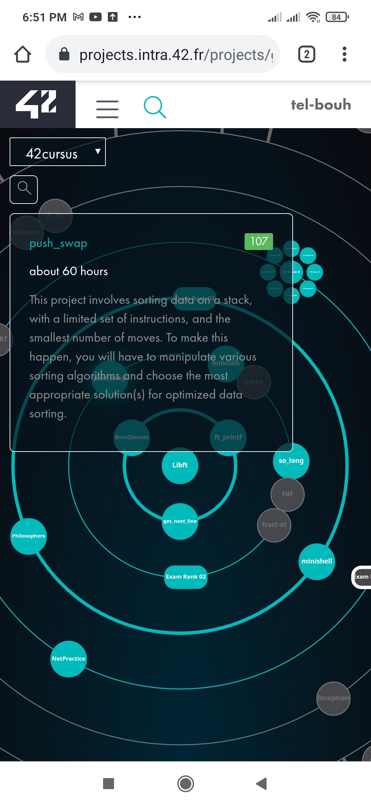

# Push_swap: the fifth pjoject in 42 cursus.

The aim of this project is to write a algotithm that will sort a set of numbers.

## Table of contents

- [ Push_swap ](#the-fifth-pjoject-in-42-cursus.)
  - [Table of contents](#table-of-contents)
  - [Overview](#overview)
  - [The project](#the-project)
  - [Screenshot](#screenshot)

## Overview

Write a program in C called push_swap which calculates and displays
on the standard output the smallest program, made of Push swap language instructions,
that sorts the integers received as arguments.

### The project

- This project will not only allow you to add a very convenient function to your collection,
  but it will also allow you to learn a highly interesting new concept in C programming:
  static variables.

### Screenshot

